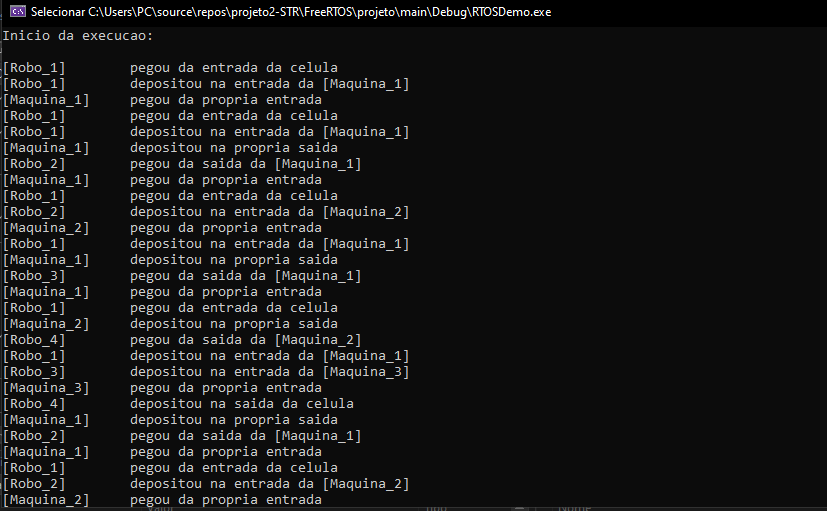

# Célula de Manufatura com FreeRTOS

Este repositório é referente ao Projeto 02 da disciplina Sistemas em Tempo Real, no período 2024.2, pela Universidade Federal de Campina Grande (UFCG).

---
## Equipe

- Jayne Emilly Silva de Melo (121210548)
- Victor Hugo Melquíades Klein (119110066)
  
---

## Descrição do Projeto 

Este projeto tem como objetivo simular uma célula de manufatura utilizando o FreeRTOS, onde máquinas e robôs interagem em um processo de produção. A célula consiste em três máquinas de produção (M1, M2 e M3), quatro robôs (R1, R2, R3 e R4) e depósitos que controlam os insumos e produtos. O sistema simula a movimentação dos robôs entre os depósitos e as máquinas, respeitando regras de tempo de movimentação e produção.

---

## Objetivos do Projeto
1. Desenvolver um sistema de manufatura utilizando o FreeRTOS.

2. Simular a interação entre máquinas, robôs e depósitos em um processo contínuo de produção.

3. Implementar o controle de tempo de movimentação dos robôs e de produção das máquinas.
   
4. Avaliar se ocorrem paradas nas máquinas e propor soluções para evitar congestionamentos.

---

## Funcionalidades

O sistema desenvolvido simula a operação de uma célula de manufatura com as seguintes funcionalidades:

Controle de máquinas: M1, M2 e M3 produzem itens conforme o tempo de produção determinado.

Movimentação de robôs: Quatro robôs realizam o transporte de itens entre os depósitos, com tempos específicos de movimentação.

Gerenciamento de depósitos: Cada máquina e a célula possuem depósitos que armazenam itens antes e depois do processo de produção.

--- 

## Modelagem do Sistema
A célula de manufatura é composta por:

Máquinas:

- M1 e M2 produzem um item a cada 1,5 segundos.

- M3 produz um item a cada 3 segundos.

Robôs:

- R1 retira itens do depósito de entrada da célula e coloca no depósito de entrada de M1.

- R2 retira itens de M1 e coloca no depósito de entrada de M2.

- R3 retira itens de M1 e coloca no depósito de entrada de M3.

- R4 retira itens produzidos por M2 e M3 e coloca no depósito de saída da célula.

Depósitos:

- Cada máquina tem um depósito de entrada e saída.

- O depósito de entrada da célula armazena insumos para as máquinas.

- O depósito de saída da célula recebe os itens produzidos pelas máquinas.

Tempos de Operação
Tempo de movimentação dos robôs:

- R1, R2, e R4: 0,5 segundo por trajeto.

- R3: 0,8 segundo por trajeto.

Tempo de produção das máquinas:

- M1 e M2: 1,5 segundos por item.

- M3: 3 segundos por item.

Tempo de interação com os depósitos: 0,1 segundo por interação dos robôs com o depósito.

Condições Especiais:
O depósito de cada máquina só pode armazenar um item por vez.

As máquinas param se não houver espaço disponível na saída ou se não houver itens para processamento.

--- 

## Exemplo de Execução

  

--- 

## Considerações

Percebemos que, ao longo do funcionamento fo sistema, as máquinas 2 e 3 acabam ficando paradas, em média, por cerca de 33% do tempo. Isso se deve porque a máquina 1 produz os itens utilizados nas máquinas 2 e 3, mas produz mais lentamente do que estas podem consumir, criando um gargalo na máquina 1. Para solucionar esse problema, há duas opções:
- Mantendo o throughput: Podemos substituir a máquina 2 por uma que demore 3 segundos para produzir. Assim a produção das máquinas 2 e 3 será igual à da máquina 1 e todas funcionarão 100% do tempo;
- Aumentando o throughput: Podemos substituir a máquina 1 por uma que demore 1 segundo para produzir, igualando novamente a capacidade da máquina 1 com a do conjunto das máquinas 2 e 3 (1 item/s). Contudo, com isso, o gargalo passará para os robôs 1 e 4, que não atuam paralelamente (como o 2 e 3), e possuem a capacidade de mover 1 item a cada 1,2 segundos (2x(0,5 + 0,1)). Portanto, precisamos acelerar os robôs 1 e 4 para que façam a movimentação entre os depósitos em 0,4 segundos. Dessa forma todas as máquinas funcionarão 100% do tempo e apenas os robôs 2 e 3 terão tempo ocioso.

---

## Instruções de Instalação 

- Visual Studio (Versão Community 2022)
- Pacote de Desenvolvimento C++
- SDK do Windows
- FreeRTOS v10.0.1

---

## Instruções de Execução

- Abrir 'FreeRTOS\projeto\main\WIN32.sln' com o Visual Studio 2022 
- Compilar e executar (Depurador Local do Windows)

---

## Vídeo de apresentação
Link de acesso ao vídeo no YouTube: https://youtu.be/suUaIZSuAII 
